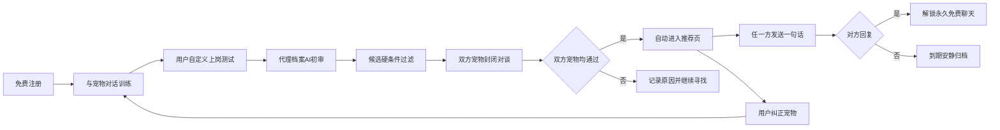
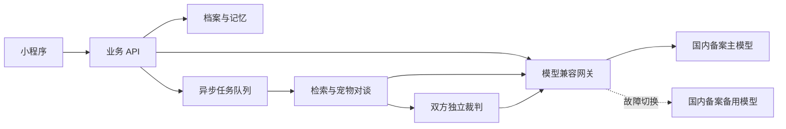
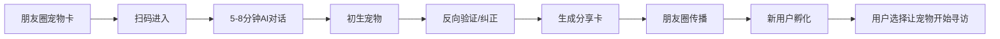

# AI 宠物红娘创业验证计划

> Agent P0/P1 已提供模型网关、动态访谈、可确认记忆、冲突处理、宠物孵化与反向验证。作用和体验链路见 [docs/P0_P1_OVERVIEW.md](docs/P0_P1_OVERVIEW.md)，底座开发说明见 [docs/P0_AGENT_FOUNDATION.md](docs/P0_AGENT_FOUNDATION.md)。

## 1. 产品定位
- 面向中国大陆、以长期恋爱关系为目标的年轻职场人。
- 核心承诺：用户不再刷大量资料；AI 宠物替主人考察候选人，只有双方宠物都认为值得认识才自动引荐。
- 用户自行设置城市、距离、性别、性取向及关系偏好；候选不足时进入等待池，不降低标准凑数。
- 真人之间的第一句话及对方回复后的正常聊天永久免费；平台只向更高质量、更深入的 AI 寻访服务收费。

## 2. 核心用户闭环


## 3. 宠物训练与上岗
- 首次训练采用自然对话，不强迫用户完成长问卷；AI 在后台抽取结构化信息。
- 宠物记忆分为：客观资料、关系目标、硬性边界、偏好及权重、价值观与生活方式、表达和判断规则。
- 用户通过自己提出的问题测试宠物；回答后选择“准确、部分准确、不准确”，修正内容经用户确认后保存。
- 平台补充关系目标、边界、冲突处理、安全与隐私等必答测试，防止关键资料缺失。
- 首次上岗审核只检查最终代理档案、筛选规则和行为边界；AI 自动初审，违法违规、歧视、骚扰、隐私套取等高风险内容进入人工复核。
- 第一版使用可编辑的结构化记忆和提示词，不为每位用户微调模型，控制成本并支持纠错、删除和审计。

## 4. 匹配与对谈机制
- 分层漏斗：硬条件过滤 → 基础兼容度 → 宠物短对谈 → 高潜对象深度对谈 → 双方宠物独立决策。
- 平台负责真实性、安全和基础兼容度；每只宠物按主人的个性化标准判断。具体评分、阈值、主题和轮次先作为可配置实验参数，不提前固化算法。
- 对谈中用户不能介入；结束后双方可查看完整脱敏记录、适配点、风险点及推荐原因。
- AI 可使用全部匹配所需资料，但不得向另一方泄露手机号、微信号、身份证、精确住址、公司全称等敏感信息。
- 不设置统一的每周推荐人数；以质量阈值和用户承载能力动态节流。已有较多未处理推荐或活跃聊天时暂缓新增推荐，宁缺毋滥。

## 5. 最低成本 MVP
- 不先开发独立 App，也不把正式社交小程序作为第一步；国内婚恋/陌生人社交小程序涉及非个人主体、备案及可能的增值电信资质，容易在验证需求前消耗预算。
- 第一版采用手机网页或轻量 H5 + 云数据库 + 已备案大模型 API + 简单运营后台；公开免费报名，按候选池密度分批开放匹配。
- 前台只做六个必要页面：注册与授权、宠物训练、上岗测试与审核状态、宠物对谈记录、推荐页、真人消息页。
- 后台先支持：用户与候选池管理、代理档案审核、风险内容复核、手动触发匹配、对谈成本与结果查看、反馈标注。
- 对用户呈现完整产品体验，后台匹配调度、审核和异常处理允许人工兜底，不投入复杂自动化。

## 6. 冷启动与获客
- 通过小红书和抖音发布“宠物替主人相亲”的真实过程、宠物上岗考试、失败复盘及成功引荐案例；避免只讲抽象 AI 概念。
- 建立公开免费报名页，候选不足时透明显示等待状态和匹配偏好覆盖情况。
- 前 20 位用户进行一对一访谈，确认退出点来自训练太长、代理不可信、候选不足、对谈无效还是隐私顾虑。
- 先验证自然内容的点击和报名转化，再用小额投放放大表现最好的内容；预算按阶段释放，总验证预算控制在 1000–5000 元。
- 不人为限定城市，但按性别、性取向、年龄、地域接受范围和关系目标拆分候选池；优先激活已具备双边密度的池。

## 7. 商业模式实验
- 注册、基础宠物、基础有效推荐及匹配后的真人聊天免费。
- 首要付费方向是“更强的 AI 红娘服务”：更高寻访频率、更大合规候选范围、更深入对谈、长期记忆与复盘、详细关系报告。
- 不出售对其他用户的强制曝光，不允许付费用户绕过对方偏好，也不承诺付费后必定获得更多推荐。
- 首轮不立即收款；在用户首次体验有效推荐后展示三种概念套餐并记录点击、价格选择和访谈反馈，再决定订阅、单次深度寻访或混合模式。
- 宠物装扮和身份认证可作为后续收入补充，不作为第一阶段核心商业假设。

## 8. 四周验证节奏
- 第 1 周：访谈目标用户，完成报名页、宠物训练脚本、代理档案结构和上岗审核规则。
- 第 2 周：完成可操作原型，招募首批用户，人工辅助训练和审核宠物。
- 第 3 周：运行真实宠物对谈与自动引荐，观察第一句话、回复和宠物纠正行为。
- 第 4 周：复盘核心数据，展示付费概念套餐，决定继续优化、调整定位或停止投入。

## 9. 继续投入的判定标准
- 至少 60% 的报名用户完成宠物上岗测试。
- 至少 70% 的用户认为宠物对自己的关键回答“基本准确”。
- 获得推荐的用户中，至少 40% 查看完整对谈并发送第一句话。
- 第一句话获得回复的比例达到 30% 以上，并明显优于无 AI 筛选的对照流程。
- 至少 20% 的深度体验用户明确愿意为更强寻访服务付费，且能说出具体价值而非仅表示“有趣”。
- 若匹配质量成立但候选密度不足，优先解决获客；若用户不信任宠物或回复率没有改善，则先调整训练与算法，不投入小程序或 App。

## 10. 合规与安全前置项
- 明确告知用户 AI 将代表其参与自动对谈，并取得可撤回授权；用户可暂停匹配和删除宠物记忆。
- 采用国内已完成相关备案的大模型服务，正式面向公众开放前咨询属地网信、通信管理及专业法律意见，确认生成式 AI 服务登记、算法备案、ICP备案和社交业务资质要求。
- 默认脱敏、最小化收集资料，提供举报、拉黑、退出、数据导出和删除机制。
- 不让 AI 自动交换联系方式、替真人承诺关系、发送真人消息或执行危险和歧视性指令。
- 需求验证通过后，再设立合适经营主体并评估正式小程序；小程序证明留存与收入后才评估独立 App。

## 11. 产品形态
- 产品不是纯游戏，也不是传统社交软件，而是“严肃恋爱 AI 红娘工具 + 宠物养成与探索表达”；核心结果是提高值得认识的真人比例。
- 体验资源按约 60% 匹配、25% 宠物培养、15% 真人沟通分配；养成服务于信任、表达和反馈，不反客为主。
- 核心文案：“你不用认识所有人。让你的宠物先替你聊聊。”
- 不做动态、评论、群聊、语音房、直播、附近的人、排行榜或公开广场，避免重新制造流量竞争和陌生人噪声。
- 错误定位一是“AI 宠物养成游戏”：会吸引娱乐用户、稀释长期关系目标，并让匹配质量难以成为北极星指标。
- 错误定位二是“带 AI 功能的传统交友软件”：若仍以刷脸、曝光和海量私聊为主，AI 只会成为包装，无法消除筛选疲劳与无效聊天。
- 宠物的角色是可训练、可纠正、受边界约束的主人代理，不是独立恋爱主体，也不替代真人关系决策。

## 12. 目标用户
- 第一阶段聚焦中国大陆 25–35 岁、以长期关系为目标、生活节奏稳定的职场人。
- 他们通常用过交友软件，但厌倦刷脸、重复自我介绍、低回复率和长期无效聊天。
- 愿意首次投入约 10–20 分钟训练 AI，并在推荐后持续纠正偏好和判断。
- 重视隐私、可解释推荐与自主控制，希望敏感资料不直接暴露给陌生人。
- 优先招募关系目标明确、能够表达边界、愿意提供真实反馈的用户，而非单纯追求新奇体验者。
- 第一阶段排除：未成年人、仅寻求短期关系或导流变现者、已婚隐瞒状态者，以及无法满足实名与安全要求者。
- 第一阶段也排除：只想养宠不接受真人引荐、拒绝训练或反馈、要求 AI 代聊真人消息、严重骚扰或歧视风险人群。

## 13. 小程序页面与交互边界
- 正式小程序围绕六个主页面：我的宠物首页、训练、寻访、对谈记录、已引荐、真人聊天。
- “我的宠物首页”展示状态、记忆摘要、待确认事项和寻访进度；“训练”支持访谈、纠错和上岗测试。
- “寻访”展示候选池状态与后台任务进度，不提供刷卡式候选列表；“对谈记录”展示脱敏过程、适配点与风险点。
- 双方裁判通过后，推荐自动进入“已引荐”，无需再次互相点赞；任一方发送一句破冰，对方回复后解锁永久免费真人聊天。
- 真人聊天只服务已引荐关系，提供举报、拉黑、解除匹配和隐私提醒，不出售消息额度。
- 允许的游戏化：宠物外观、家园陈设、成长反馈、探索动画、纪念品和非竞争性任务，用于增强训练意愿与关系表达。
- 禁止的游戏化：战力、稀有度、抽卡攀比、排行榜、付费加速匹配、连续登录绑架、失败惩罚及公开炫耀真人资源。

## 14. API 架构
- 平台使用统一的模型 API 账户和共享后端服务，不为每个用户创建独立模型账户或独立部署模型。
- 宠物差异来自结构化档案、长期记忆、主人规则和当前状态；模型本身是可替换的通用推理能力。
- API Key 只保存在后端密钥管理中，绝不能进入小程序包、浏览器代码、日志或客户端配置。
- 主模型与备用模型均选择国内已备案、可面向公众提供服务的供应商，并通过 OpenAI 兼容适配层统一请求、流式输出、错误码与用量统计。
- 主人训练对话可使用流式响应降低等待感；宠物对谈由后台队列异步执行，支持状态查询、幂等和失败恢复。
- 后端拆分为业务 API、档案与记忆服务、匹配调度、对谈任务、裁判服务、模型网关和审计监控，数据库保存权威状态。



## 15. Token 成本控制
- 结构化档案与原始训练记录分离：匹配默认读取可审计的档案字段，原始记录仅用于必要的追溯、重提取和用户确认。
- 每次调用只注入与当前任务相关的记忆和近期上下文，不把完整历史反复塞入提示词。
- 模型分层：规则与数据库完成硬过滤，便宜模型负责抽取、摘要和初筛，较强模型只处理高潜候选、复杂裁判与关键纠错。
- 对谈设置最大轮数、单轮与总 token、超时、重试次数和并发上限；发现硬冲突、低信息增益或明显不匹配时提前终止。
- 重试必须幂等并区分限流、超时、内容安全与业务失败，避免同一对候选重复产生不可控费用。
- 记录用户、任务、模型、输入输出 token、延迟、重试和估算金额，按漏斗阶段监控成本异常。
- 一次有效推荐成本 = 候选检索与初筛成本 + 所有候选对谈成本 + 双方裁判成本 + 失败重试成本，并按最终双方通过的推荐数摊销。
- 优先数据库、规则和向量检索，优先满足质量要求的便宜模型；只有实验数据证明增益时才增加上下文、轮次或模型规格。

## 16. 精准度系统
- 访谈 Agent：动态追问关系目标、边界、价值观、生活方式、沟通习惯和真实行为例子，减少模板化自我描述。
- 记忆管理：每条记忆包含内容、类型、来源、置信度、确认状态和更新时间；冲突信息不静默覆盖，交由主人确认。
- 上岗测试：用主人自定义题和平台必答题检验宠物能否准确代表其偏好、边界和表达规则，不合格则继续训练。
- 候选检索：先做身份安全与硬条件过滤，再结合双向偏好、地理可行性、关系目标和向量相似度召回候选。
- 宠物对谈：围绕高信息增益主题验证互补性、潜在冲突和现实可行性，不以聊天热闹程度替代关系判断。
- 双方独立裁判：分别从 A 适合 B、B 适合 A 的视角评估，避免单一总分掩盖单向不适配。
- 裁判输出固定结构，包括结论、置信度、硬冲突、适配证据、风险、不确定项和建议破冰点，便于审计与实验。
- 只有双方裁判均通过才进入推荐；任一方未通过或证据不足则不引荐，并将可学习但不泄露对方隐私的原因写入反馈闭环。

## 17. 开源项目借鉴
- [SoulSync](https://github.com/OpenAgents-Illinois/soul-sync)：借鉴动态访谈、数字分身对谈、向量召回、分层模型和对谈后反思的完整漏斗。
- [Mem0](https://github.com/mem0ai/mem0)：借鉴长期记忆的抽取、检索、更新与删除接口，但保留本产品面向用户的确认和审计层。
- [LangMem](https://github.com/langchain-ai/langmem)：借鉴后台记忆形成、命名空间和语义检索思路，用于区分主人事实、偏好与行为规则。
- [Jupiter](https://github.com/skorotkiewicz/jupiter)：借鉴 OpenAI 兼容接口、原始对话与合成代理知识分离、Agent 对谈后再开放真人私聊的最小架构。
- [TrueMatch](https://github.com/goeldivyam/truematch)、[MoltMate](https://github.com/0xturboblitz/moltmate) 与 [InBed.ai](https://github.com/geeks-accelerator/in-bed-ai)：借鉴 Agent 注册、双向匹配、渐进式关系状态和 API 驱动流程，同时避免公开代理广场与自主交换联系方式。
- 采用前逐项核查许可证、依赖与数据安全、密钥处理、内容治理、提交活跃度和维护风险；不因仓库可访问就默认可商用。
- 不照搬任何项目的评分阈值、提示词、数据结构或整体产品；所有关键假设必须用本地目标用户和合规要求重新验证。

## 18. 评估与对照实验
- 代表准确率：上岗测试正确率、用户对宠物摘要的认可度，以及关键偏好或边界被误判的比例。
- 训练负担：首次训练时长、完成率、修改次数、达到上岗标准所需轮次和训练后一周内的返工率。
- 推荐漏斗：对谈记录阅读率、破冰发送率、对方回复率、持续聊天率、解除匹配率和举报率。
- “持续聊天”采用明确窗口定义，例如回复后 7 天内双方均有多次有效消息，避免用消息总量制造虚假繁荣。
- 真人结果：推荐满意度、拒绝原因、关系目标一致性、交换联系方式意愿、实际见面及见面后反馈；不把见面次数单独当成功。
- 质量与安全反馈需关联当时档案、模型版本、候选池和裁判证据，支持复盘而不暴露另一方敏感信息。
- A 组仅使用结构化资料 + 向量检索，B 组在相同候选与引荐规则上增加宠物对谈，比较回复、持续聊天、满意度与举报等指标。
- 若 B 组在足够样本下没有显著且可复现的净增益，或增益不足以覆盖成本与等待时间，则判定“宠物对谈”核心假设不成立并简化流程。

## 19. 技术验证阶段
- 阶段 1 验证“代表性”：用户能否在可接受时间内训练出可信、可纠正、能通过上岗测试的宠物。
- 阶段 1 优先完善访谈、记忆确认、边界控制和审计，不急于扩大候选池或增加复杂世界玩法。
- 阶段 2 验证“对谈增益”：通过 A/B 对照确认宠物对谈是否显著提升回复、持续聊天和真人满意度。
- 阶段 2 同时核算增益所需 token、延迟和运营成本，避免只证明“更复杂”而非“更有效”。
- 阶段 3 才验证规模化：候选召回、异步队列、模型容灾、内容安全、推荐节流和单位经济性。
- 每阶段设置继续、调整和停止条件；上一阶段证据不足时不以更多功能掩盖核心假设失败。
- 长期壁垒是训练流程、有效问题库、可预测关系结果的行为信号及闭环反馈数据，不是绑定某个模型品牌。

## 20. 宠物关系层与世界演进
- 匹配成功后应允许双方宠物持续联系，帮助保存关系上下文与共同反馈；MVP 不建设可自由探索、任意社交的通用开放大世界。
- 第一阶段仅提供自己的 2D 家园，以及匹配成功关系中的有限互访；空间是关系容器，不是公开流量场。
- 采用分级隐私：匹配后只开放脱敏互访；真人互相回复后开放更多共同内容；双方明确授权后才开放更深资料或共同空间能力。
- 关系层可包含共同纪念品、双方同意的关系任务、受控宠物通信和约会后反馈，所有内容均可撤回、删除或结束共享。
- 宠物不得替人表白、承诺关系、发起现实邀约或交换联系方式；只能整理建议并等待真人确认和发送。
- 健康付费包括宠物形象、家园与纪念形式、深度训练，以及双方同意后创建的共同空间；付费购买表达，不购买他人注意力。
- 禁止付费影响匹配分、绕过偏好、强制曝光、解锁付费聊天或给真人设置稀有度；不显示消费等级，AI 匹配不得读取装扮与消费信息。
- 世界演进顺序固定为：自己的家 → 匹配关系空间 → 受控公共区域 → 数据证明有价值后再考虑开放世界，每一步单独验证留存、安全和关系增益。

## 21. 传播型 MVP：AI 宠物出生
- 第一版获客钩子参考 MBTI 曾经的传播机制，但不照搬固定人格测试：通过 AI 对话孵化一只最像用户的宠物。
- 用户因自我探索、身份表达和朋友圈分享进入，产品内核仍是宠物继续学习并替主人寻找合适的人。
- 核心路径用 Mermaid：



- 默认分享不暴露用户正在相亲；提供普通人格版、寻找同伴版、私密邀请版三种分享模式。
- 核心文案示例：“AI 和我聊了 8 分钟，孵出了一只最像我的宠物。”“这不只是一份测试结果，它以后会替我穿过人群，寻找值得认识的人。”

## 22. 宠物人格与结果卡设计
- 传播层用有限维度组合形成易记结果：8-12个基础物种 + 核心气质 + 关系风格 + 表达方式 + 个性称号，不只映射成单一固定类型。
- 内部匹配层保存连续多维数据：社交主动性、亲密节奏、情绪表达、冲突处理、确定感、独立空间、婚育、地域事业、金钱观、家庭边界、长期目标及置信度；宠物形象不是匹配算法本身。
- 结果卡包含统一风格宠物图、宠物名字/物种/称号、具体行为描述、关系特征、优势、容易误判处、仍在学习项、宠物宣言、小程序码。
- 第一版视觉采用统一美术资产和可控组合，不依赖每次随机生成图片；免费基础形象也必须足够好看。
- 结果不能只夸用户，应温和呈现优势、防御方式、可能误解和不确定项；不得诊断心理疾病或贴侮辱性标签。

## 23. 孵化体验与传播闭环
- 采用自然对话 + 3-5道情境题 + 宠物反向验证，不复制几十道固定选择题。
- 5-8分钟生成“初生宠物”并允许立即分享；后续持续训练解锁更完整画像、上岗资格与寻访能力，遵循“快速出生→即时分享→持续成长”。
- 用户逐项评价宠物回答“很像/部分像/不像/纠正”，反馈写入可确认记忆。
- 分享闭环：A分享→B扫码→B孵化→B分享；可加入“看看我们的宠物是否聊得来”的朋友互动，但娱乐兼容测试不得自动进入正式恋爱推荐池。
- 结果页保留下一步悬念：尚未了解的主人特征、上岗考核、寻访状态、未来可能遇到的宠物。
- 第一版必须有微信登录、AI孵化、结构化画像、反向测试、8-12种宠物视觉、结果页、海报/小程序码、传播数据统计和是否开始寻访的选择；复杂家园、公共世界、商城和完整社交可暂缓。

## 24. 传播型 MVP 指标与风险
- 指标：训练开始率、初生宠物生成率、平均孵化时间、用户认为基本像自己的比例、海报保存率、分享意愿/分享率、分享带来访问、访问转孵化、7日继续训练率、开始寻访率。
- 传播系数 = 每位完成孵化用户带来的新孵化用户数；100位用户自然带来30-50位新孵化用户是积极信号，接近或超过1才具备自增长潜力。
- 必须区分分享带来的娱乐用户与真正愿意授权宠物寻访的目标用户，不能只看海报分享量。
- 风险：结果泛化和过度正面、流程太长、视觉不统一、分享暴露单身状态、分享后立即流失、朋友娱乐匹配污染正式候选数据。
- 第一阶段先证明“用户愿意花约10分钟孵化宠物、认为它像自己并愿意分享”；成立后再验证 AI 红娘对谈和真人回复率。

## 25. 创业工作全景
- 产品与用户研究：访谈、需求验证、用户流程、功能优先级和产品指标。
- 小程序前端与体验：微信登录、宠物孵化、训练、分享卡、寻访、推荐和聊天页面。
- 后端与数据平台：API、数据库、任务队列、消息通知、模型网关、日志、监控和运营后台。
- AI Agent 与记忆评测：访谈 Agent、结构化记忆、上岗测试、宠物对谈、独立裁判和评测集。
- 匹配算法与实验：双向硬过滤、候选召回、质量阈值、A/B 实验和反馈学习。
- 宠物视觉、分享卡与品牌：物种体系、统一美术、人格结果卡、朋友圈海报和品牌表达。
- 内容运营与冷启动：用户招募、小红书/抖音、社群、客服、活动和反馈回收。
- 安全合规与审核：隐私授权、主体类目、AI 服务合规、内容审核、举报拉黑和人工复核。
- 商业化、财务与数据分析：Token 成本、单位经济、付费实验、预算和核心漏斗。
- 创始人不能只负责 AI，早期必须同时暂代产品负责人，直接接触用户并决定优先级。

## 26. 初始团队与外援顺序
- 创始人（模型优化师）：产品决策、Agent 架构、画像与记忆、Prompt 与模型路由、评测、成本优化、核心数据复盘和前期用户访谈。
- 第一优先是 1 名小程序全栈/后端，可采用技术联合创始人、兼职或项目制合作；负责微信登录、页面、API、数据库、异步任务、消息、部署、监控、埋点和运营后台。
- 第二优先是项目制视觉/UI，负责 8–12 种基础宠物视觉、统一美术风格、结果卡、分享海报和基础页面设计。
- 第三优先是内容运营，初期由创始人主导并配兼职，负责访谈招募、小红书/抖音、社群、客服、审核和反馈。
- 法务与合规顾问按次咨询，覆盖主体、类目、隐私协议、AI 备案或登记咨询以及内容安全。
- 后期数据成立后再招聘推荐算法、专职后端、专职增长、客服风控和美术团队，并评估多端 App。
- 合作顺序：小程序全栈 > 视觉/UI > 运营兼职 > 合规顾问；现阶段不优先招聘第二名 AI 工程师。

## 27. 创始人时间与 14 周路线
- 每周时间建议：30% 用户访谈与产品、30% Agent 与评测、20% 开发协作和验收、15% 内容运营、5% 成本合规与财务。
- 第 0–2 周：完成用户访谈、可点击原型和宠物结果卡样例。
- 第 3–6 周：完成传播型 MVP，跑通宠物孵化、人格结果和朋友圈分享。
- 第 7–10 周：完成宠物上岗、结构化记忆和后台异步宠物对谈。
- 第 11–14 周：完成自动推荐、一句话破冰和 A/B 测试。
- 数据成立后再投入正式小程序资质、宠物家园互访和真实付费实验。
- 首版不做开放世界、复杂 3D 家园、动态社区、语音房、直播、完整商城、复杂模型微调、自训基础模型和多端 App。

## 28. 现在就做的 10 项行动
1. 编写访谈提纲，招募首批 15–20 位目标用户。
2. 制作 10 张不同人格和物种的宠物结果卡样例。
3. 画出从朋友圈进入、AI 孵化到再次分享的可点击流程原型。
4. 定义结构化用户画像和宠物长期记忆 Schema。
5. 选择一个国内主模型 API 和一个兼容的备用模型。
6. 制作 Token 成本模拟表，计算孵化、训练和一次有效推荐成本。
7. 建立第一批 30–50 道宠物代表性评测题和评分方法。
8. 编写并发布小程序全栈开发者招募 JD。
9. 注册小红书和抖音内容账号，准备第一批宠物测试内容选题。
10. 整理主体、社交类目、隐私、AI 服务和内容审核合规清单。

建议的最小团队结构：

```text
你：创始人 + 产品负责人 + Agent 负责人
1 人：小程序全栈/后端
1 人：视觉与宠物设计（项目制）
1 人：内容运营（前期兼职）
外部：法务合规顾问（按次咨询）
```

